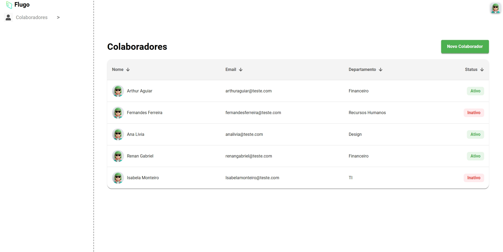
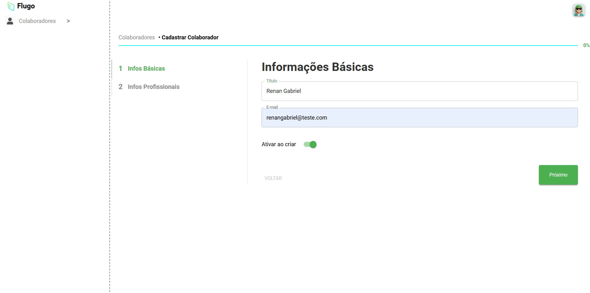
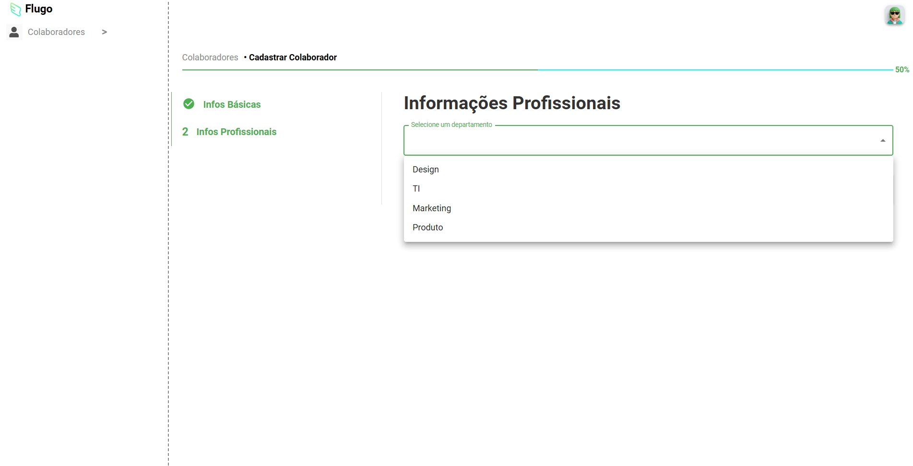

# Sistema de Gerenciamento de Colaboradores 🧑‍💻 | Desafio Técnico para Desenvolvedor React - Flugo

Este é um sistema de gerenciamento de colaboradores, uma aplicação web que permite visualizar, adicionar e gerenciar informações de funcionários. O projeto é um Single Page Application (SPA) construído com **React**, utilizando uma abordagem de formulário em múltiplos passos para o cadastro de novos colaboradores e o **Firebase** como backend para persistência de dados.

O design da interface é responsivo e foi implementado usando a biblioteca de componentes **Material-UI (MUI)**.




---
## Deploy 🌐

Este projeto está disponível online. Você pode acessá-lo aqui:

[https://multi-step-employee-form.vercel.app](https://multi-step-employee-form.vercel.app)

---

## Funcionalidades ✨

* **Listagem de Colaboradores:** Exibe uma tabela com o nome, e-mail, departamento e status (ativo/inativo) de todos os colaboradores cadastrados.
* **Cadastro em Múltiplos Passos:** Um formulário dividido em duas etapas para coletar informações básicas e profissionais de um novo colaborador.
* **Validação de Formulário:** Utiliza a biblioteca **Zod** para garantir que os dados inseridos (como formato de e-mail e preenchimento de campos obrigatórios) estejam corretos.
* **Barra de Progresso:** Um indicador visual acompanha o usuário durante o processo de cadastro.
* **Integração com Firebase:** O projeto usa o **Firebase Firestore** para armazenar e buscar os dados dos colaboradores, funcionando como um banco de dados NoSQL.
* **Navegação e Rotas:** Gerenciamento de rotas com `react-router-dom` para navegar entre a lista de colaboradores e o formulário de cadastro.
* **Layout Responsivo:** O layout se adapta a diferentes tamanhos de tela, com uma barra lateral que pode ser expandida ou recolhida em dispositivos móveis.

---

## Tecnologias Utilizadas 🚀

* **React.js:** Biblioteca JavaScript para construir a interface do usuário.
* **Material-UI (MUI):** Framework de componentes React para um design de interface elegante e consistente.
* **React Router DOM:** Para gerenciar a navegação e as rotas da aplicação.
* **Firebase (Firestore):** Banco de dados em tempo real e backend-as-a-service (BaaS) para armazenar os dados.
* **Zod:** Biblioteca para validação de esquemas, garantindo a integridade dos dados do formulário.
* **Vite:** Ferramenta de build rápida para o desenvolvimento front-end.
* **TypeScript:** Adiciona tipagem estática ao código JavaScript, melhorando a escalabilidade e a manutenção.
* **React Icons:** Biblioteca de ícones para uso nos componentes da interface.

---

## Como Rodar o Projeto Localmente ⚙️

Siga os passos abaixo para configurar e rodar o projeto na sua máquina.

### 1. Pré-requisitos
Certifique-se de ter o **Node.js** e o **npm** (ou Yarn) instalados na sua máquina.

### 2. Configuração do Firebase
Para que a aplicação se conecte ao banco de dados, é necessário configurar as credenciais do Firebase.

1.  Crie um projeto no console do Firebase.
2.  No seu projeto do Firebase, adicione um novo aplicativo web e copie as configurações do SDK.
3.  Crie um arquivo `.env` na raiz do projeto e adicione suas chaves:

```env
VITE_FIREBASE_API_KEY="SUA_API_KEY_AQUI"
VITE_FIREBASE_AUTH_DOMAIN="SEU_AUTH_DOMAIN_AQUI"
VITE_FIREBASE_PROJECT_ID="SEU_PROJECT_ID_AQUI"
VITE_FIREBASE_STORAGE_BUCKET="SEU_STORAGE_BUCKET_AQUI"
VITE_FIREBASE_MESSAGING_SENDER_ID="SEU_MESSAGING_SENDER_ID_AQUI"
VITE_FIREBASE_APP_ID="SEU_APP_ID_AQUI"
```
### 3. Instalação e Execução

1. Clone o repositório:
```
git clone https://github.com/renelps/multi-step-employee-form.git
cd multi-step-employee-form
```
2. Instale as dependências do projeto:
```
npm install
```
3. Inicie o servidor de desenvolvimento:
```
npm run dev
```
A aplicação estará disponível em http://localhost:5173

### Scripts Disponíveis 🛠️

* **npm run dev:** Inicia o servidor de desenvolvimento com o Vite.
* **npm run build:** Compila o projeto para produção.
* **npm run preview:** Inicia um servidor local para visualizar a build de produção.
* **npm run lint:** Executa a ferramenta de linting para verificar a qualidade do código.
